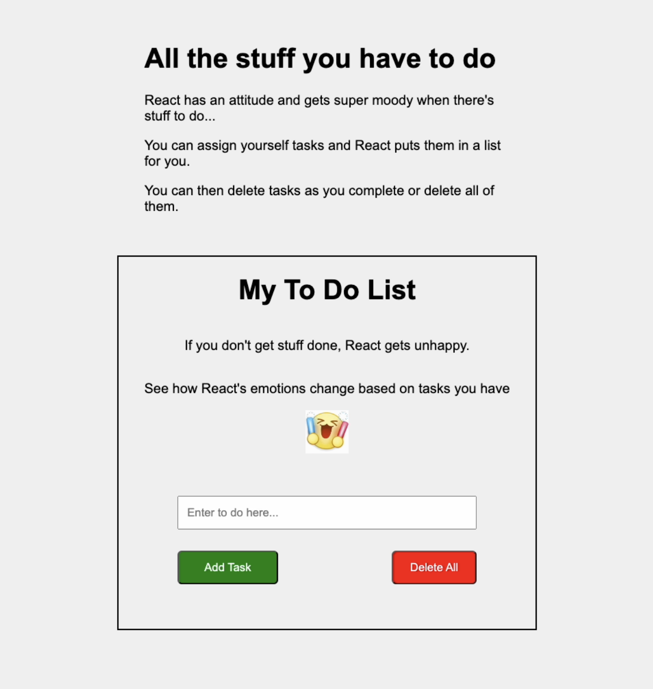
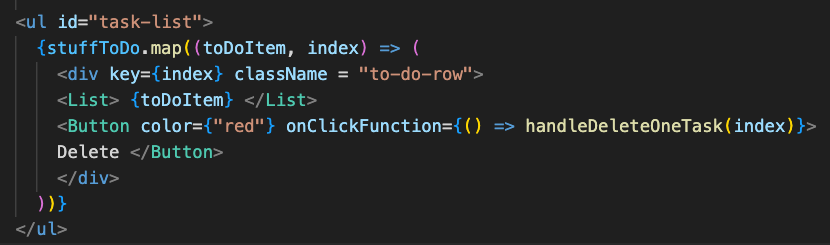

# Emojified React To Do App

---

# Intro
This project was created in my 13th week of coding bootcamp, using React and CSS. The concepts of Javascript and HTML are indirectly used through my JSX returns. 

Note: While typically I have a section for "what I learned", in this write-up, my learnings are integrated in my discussion about the components and functions.

---

# Design 
The app is designed with both mobile/desktop reponsiveness, and consists of two sections:
1. Main - The main title and the blurb about the app reside here. The one-liner about how React gets moody when there's stuff to do helps to humanize the app and allowing users to feel a personal connection.
2. To Do - The main to-do app content exists here: the app heading, the caption describing the dynamic emoji (which represents React's current emotion), the input bar, the buttons, and the list of tasks.



When planning the layout, I host all root css in the `App.css` and render the `Main.jsx` and `ToDo.jsx` components there. The `ToDo.jsx` uses the `Button` and `List` component. All css styles for the ToDo and its aforementioend components live within `ToDo.css`.


As you see in our diagram above, besides the app.jsx which serves as the entry point- there are:
- Section Components: 2 .jsx files for the two parts of the to do landing page 
- UI components: 2 .jsx files for the list and button 

## Styling

The `body` is set as a flexbox, which allows us to use `justify-content: center` so that our content shows centered. The media query in the `app.css` allows our content to take the full width of the viewer's screen when on mobile devices. On desktop devices, the display is resized to take up 50% of the viewer's screen - with a max width of 800 px to prevent excessive size. 

With the `.to-do-row` which is each row for a `toDoItem` and its respective delete button, I used a negative margin so force move the row to the left.
`margin-left: -40px;`

---

# Section Components
 
## Main.jsx
The `return` renders the HTML structure of the main section. The elements are enclosed within the `main` tags - allowing for a singular return (and eliminating the need to use fragments).

## ToDo.jsx

### Hooks 
The ToDo component starts with the data, in this case the `useState` hooks which represent the initial state of the stateVariables: 
- `stuffToDo` to do list contents 
- `newTodoTextInput`: value of input field for adding new tasks 
- `errorMessage`: error message to be displayed 
- `reactEmotion`: how React is feeling based on how many tasks in `stuffToDo` 

Those stateVariables can be updated with the setter. We are able to use those stateVariables and their setters because of array destructuring, which means we are essentially assigning those names to the elements of the array that  `useState`  returns.

The stateVariables above are respectively initalized with:
- an empty array of tasks
- a blank text input
- a blank error message
- the happy gif's src to reflect how we start with no tasks to do

---

# UI Components

## Button.jsx
The Button component is reused throughout the app- and there are 3 attributes that are passed on as props from the `ToDo.jsx`: the custom `color` attribute, the `onClickFunction`, and `children` (which refers to the text of the button). 

For example, to render a delete button in our ToDo.jsx, we write the following:

```
<Button color={"red"} onClickFunction={handleDeleteAllTasks}> Delete All </Button>
```

You start with the attribute variable and then its value in brackets.  `children` refers to whatever content you have nested in between the open and closing tags. 


The delete button uses the Button component defined below:
(Notice how the props are passed with the ({props here})) syntax- and that is because the bracket ` { } ` destructures the `props` object that is implicitly passed to the Button component and the `( )` is how we pass those props along as  "parameters." Destructuring allows us to refer to the props (attributes) by their variable name instead of having to write `props.color`, etc. (In other words, within here `({ color, children, onClickFunction })` are just simply variables representing the props. Then when the button is called, that is when the values are provided.)

```
const Button = ({ color, children, onClickFunction }) => {
    return (
        <button className={color === "red" ? "redBtn" : "greenBtn"} onClick={onClickFunction}>
            {children}
      </button>    
    );
};
```

We want to be able to reuse the button component and just have its color change based on the button type. Thus, we use a ternary that checks the value of the custom `color` attribute and then a className is assigned (and that corresponds to the color style as defined in the `ToDo.css`.)

## List.jsx
The List component is used for rendering the list of tasks. It returns a structure with the bullet points and the `children` prop which displays with each bullet point. In this case, it's the `toDoItem` which represents a task of the `stuffToDo` array as we map over it. 

While we could pass along the `toDoItem` directly as a prop, using `children` allows our list item to be more flexible - to take any type of text or other content type by the bullet points. 

In the ToDo.jsx, the following code maps the `stuffToDo` iterating through each `toDoItem` and mapping them to List.jsx component. 



# Functions

## handleInput
We need a function to handle the input since React doesn't automatically detect those changes. We use an `onChange` event handler which calls `handleInput`. The event object is implicity included in its argument. 

When we define `handleInput`, we pass along the `event` as the paramater so we can access the `event.target.value` which is what the user input. `event.target` is what attribute triggered the event of `onChange` (in this case the input value) and we call `.value` so we get the input field's value.

```
// rendering input in JSX return
 <div>
        <input
          id="todo-input"
          name="todo"
          placeholder = "Enter to do here..."
          value={newTodoTextInput}
          type="text"
          onChange={handleInput} //callback to handleInputChange when user enters task
        />
```

```
// event handler function
const handleInput = (event) => {
    setNewToDoTextInput(event.target.value)
  }
```
While the initial state of `newToDoTextInput` is blank (meaning value = {""})... the stateVariable's setter of `setNewToDoTextInput` is used to update the state of `newToDoTextInput` based on what the user input. 

## errorMessage
This is to provide user feedback if they either try to add a blank task, or try to delete all tasks when there are none to delete. Not only does this help with error handling, but it prevents the user from being in a black hole about the the status of their interactions with the app. 

In the JSX return, the error message is rendered as follows (and it will appear):

```
<p id="error-message"> {errorMessage} </p>
```

The `errorMessage` state is tightly coupled with the if/else logic in the functions to add a task/ delete all tasks. If the task is blank or there are no tags to delete respectively, an error message will show. Otherwise if the task is able to be added or there are tasks to delete (and they were deleted), then the errorMessage clears. We clear it after the successful operation to ensure that we don't prematurely remove the error message if for some reason the add/delete-all doesn't successfully run.

Also note that since the errorMessage's state is tightly coupled and contained within the functions `handleAddTask` and `handleDeleteAllTasks` (both of which are triggered by a button being clicked) and is not dependent on a state variable changing, we don't need to use the `useEffect`hook.


## handleAddTask

We check to see if the `newToDoTextInput` is not blank, and if so, we use the spread operator to create a copy of the `stuffToDo` array and  add the `newToDoTextInput`. We then set the state of `stuffToDo` with its setter to this new updated array. 

Note:  We always want to make a copy of array because of the principle of immutability and so that React can detect when there are changes.

## handleDeleteAllTasks

We check to see if there are tasks to delete by seeing if the `stuffToDo` array length is greater than 0. If so the setter is used to set `stuffToDo` back to an empty array as all tasks are deleted.

## handleDeleteOneTask

`handleDeleteOneTask` is called when the delete button is clicked. 
You can see the code block pasted again here for convenience:

```
 {stuffToDo.map((toDoItem, index) => (
          <div key={index} className = "to-do-row">
          <List> {toDoItem} </List> 
          <Button color={"red"} onClickFunction={() => handleDeleteOneTask(index)}> Delete </Button>
          </div>
 ))}
 ```

 Notice how as we iterate over each `toDoItem` a div is created with an `index`, and the div contains the `toDoItem` mapped with the `List` component and the button mapped with the `Button` component- and the button's onClickFunction of `handleDeleteOneTask` is passed the `index` as a parameter. This is how the program is able to know which task to delete.

We use the spread operator to create a copy of the `stuffToDo` array. Then, we use `currentTaskList.splice(index, 1)` to remove that one element at the `index` parameter. Then we use `setStuffToDo` to update the array's state to the one that excludes the deleted task. 

## showReactEmotion
This was a bonus featured I added to the app, injecting a bit of humor as React's emotions change based on how many tasks the user has.
The function is defined by an if/else and checking the length of the `stuffToDo` array, and then setting the emotion to the imported gif asset's address. We then use `useEffect` to trigger the `showReactEmotion` (aka "call the function so that execute) when `stuffToDo` state changes. 
We use `useEffect` here because this function is tightly coupled with the state variable changing.

---
# Demo 
I've recorded a quick ~ one minute demo that shows the user experience flow. 
You may watch that video [here](src/assets/todo-app-demo.mov).
